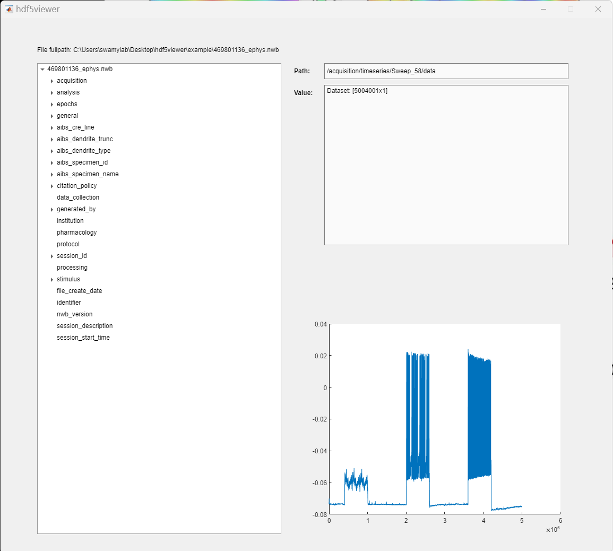

[](https://www.gnu.org/licenses/gpl-3.0)  [](https://www.mathworks.com/matlabcentral/fileexchange/157826-hdf5viewer)  

This MATLAB-based function is to create a UIFigure viewer for hdf5 files, including Neurodata Without Border (NWB) files. Tested in MATLAB R2022a (2024-Jan-17). Inspired by the online hdf5 viewer: https://myhdf5.hdfgroup.org/

<b>Example</b>
```Matlab
hdf5fn = '469801136_ephys.nwb';
hdf5viewer(hdf5fn)
```

<div align=center></div>


Get example hdf5 files from:
- nested.hdf5: <br> [https://github.com/jupyterlab/jupyterlab-hdf5/tree/master/example](https://github.com/jupyterlab/jupyterlab-hdf5/tree/master/example) 
- 469801136_ephys.nwb:  <br> Allen Brain Institute Cell Types Database ([http://api.brain-map.org/api/v2/well_known_file_download/491200026](http://api.brain-map.org/api/v2/well_known_file_download/491200026))
- sub-716595522_ses-718048934_icephys.nwb: <br> Allen Brain Institute Cell Types Database ([https://dandiarchive.org/dandiset/000020/](https://dandiarchive.org/dandiset/000020/))

If you use this code in your work, please cite it via the citation widget in the sidebar of this repository, or

>X. Ma, hdf5viewer_matlab, (2024), GitHub repository, [https://github.com/XinyueMa-neuro/hdf5viewer_matlab](https://github.com/XinyueMa-neuro/hdf5viewer_matlab).

-----
Author: Xinyue Ma <br>
Email: xinyue.ma@mail.mcgill.ca <br>
PhD student, Integrated Program in Neuroscience <br>
McGill University <br>
Montreal, QC, H3A 1A1 <br>
Canada 
